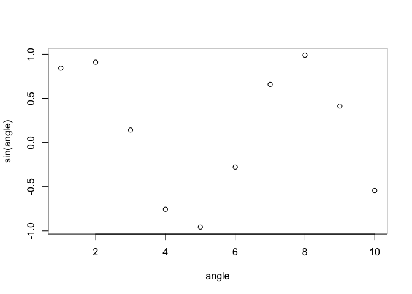

[](https://cran.r-project.org/package=wrapr)
[](https://CRAN.R-project.org/package=wrapr)

<!-- README.md is generated from README.Rmd. Please edit that file -->

[`wrapr`](https://winvector.github.io/wrapr/) is an
[`R`](https://cran.r-project.org) package that supplies powerful tools
for writing and debugging `R` code.


## Introduction

Primary `wrapr` services include:

  - [`%.>%`](https://winvector.github.io/wrapr/reference/dot_arrow.html)
    (dot arrow
    pipe)
  - [`unpack`](https://winvector.github.io/wrapr/reference/unpack.html)/[`to`](https://winvector.github.io/wrapr/reference/to.html)
    (assign to multiple
    values)
  - [`as_named_list`](https://winvector.github.io/wrapr/reference/as_named_list.html)
    (build up a named list
    quickly)
  - [`build_frame()`](https://winvector.github.io/wrapr/reference/build_frame.html)
    /
    [`draw_frame()`](https://winvector.github.io/wrapr/reference/draw_frame.html)
    ( `data.frame` builders and formatters )
  - [`qc()`](https://winvector.github.io/wrapr/reference/qc.html)
    (quoting
    concatenate)
  - [`:=`](https://winvector.github.io/wrapr/reference/named_map_builder.html)
    (named map builder)
  - [`%?%`](https://winvector.github.io/wrapr/reference/coalesce.html)
    (coalesce)
  - [`%.|%`](https://winvector.github.io/wrapr/reference/reduceexpand.html)
    (reduce/expand
    args)
  - [`uniques()`](https://winvector.github.io/wrapr/reference/uniques.html)
    (safe `unique()`
    replacement)
  - [`partition_tables()`](https://winvector.github.io/wrapr/reference/partition_tables.html)
    /
    [`execute_parallel()`](https://winvector.github.io/wrapr/reference/execute_parallel.html)
  - [`DebugFnW()`](https://winvector.github.io/wrapr/reference/DebugFnW.html)
    (function debug
    wrappers)
  - [`λ()`](https://winvector.github.io/wrapr/reference/defineLambda.html)
    (anonymous function builder)
  - [`let()`](https://winvector.github.io/wrapr/reference/let.html) (let
    block)
  - [`evalb()`/`si()`](https://winvector.github.io/wrapr/articles/bquote.html)
    (evaluate with `bquote` / string interpolation)
  - [`sortv()`](https://winvector.github.io/wrapr/reference/sortv.html)
    (sort a data.frame by a set of columns).

<!-- end list -->

``` r
library(wrapr)
packageVersion("wrapr")
 #  [1] '2.0.1'
date()
 #  [1] "Mon Aug 10 12:13:57 2020"
```

## [`%.>%` (dot pipe or dot arrow)](https://winvector.github.io/wrapr/articles/dot_pipe.html)

`%.>%` dot arrow pipe is a pipe with intended semantics:

> “`a %.>% b`” is to be treated *approximately* as if the user had
> written “`{ . <- a; b };`” with “`%.>%`” being treated as
> left-associative.

Other `R` pipes include
[`magrittr`](https://CRAN.R-project.org/package=magrittr) and
[`pipeR`](https://CRAN.R-project.org/package=pipeR).

The following two expressions should be equivalent:

``` r
cos(exp(sin(4)))
 #  [1] 0.8919465

4 %.>% sin(.) %.>% exp(.) %.>% cos(.)
 #  [1] 0.8919465
```

The notation is quite powerful as it treats pipe stages as expression
parameterized over the variable “`.`”. This means you do not need to
introduce functions to express stages. The following is a valid
dot-pipe:

``` r
1:4 %.>% .^2 
 #  [1]  1  4  9 16
```

The notation is also very regular as we show below.

``` r
1:4 %.>% sin
 #  [1]  0.8414710  0.9092974  0.1411200 -0.7568025
1:4 %.>% sin(.)
 #  [1]  0.8414710  0.9092974  0.1411200 -0.7568025
1:4 %.>% base::sin
 #  [1]  0.8414710  0.9092974  0.1411200 -0.7568025
1:4 %.>% base::sin(.)
 #  [1]  0.8414710  0.9092974  0.1411200 -0.7568025

1:4 %.>% function(x) { x + 1 }
 #  [1] 2 3 4 5
1:4 %.>% (function(x) { x + 1 })
 #  [1] 2 3 4 5

1:4 %.>% { .^2 } 
 #  [1]  1  4  9 16
1:4 %.>% ( .^2 )
 #  [1]  1  4  9 16
```

Regularity can be a *big* advantage in teaching and comprehension.
Please see [“In Praise of Syntactic
Sugar”](https://win-vector.com/2017/07/07/in-praise-of-syntactic-sugar/)
for more details. Some formal documentation can be found
[here](https://github.com/WinVector/wrapr/blob/master/extras/wrapr_pipe.pdf).

<ul>

<li>

Some obvious “dot-free”" right-hand sides are rejected. Pipelines are
meant to move values through a sequence of transforms, and not just for
side-effects. Example: `5 %.>% 6` deliberately stops as `6` is a
right-hand side that obviously does not use its incoming value. This
check is only applied to values, not functions on the right-hand side.

</li>

<li>

Trying to pipe into a an “zero argument function evaluation expression”
such as `sin()` is prohibited as it looks too much like the user
declaring `sin()` takes no arguments. One must pipe into either a
function, function name, or an non-trivial expression (such as
`sin(.)`). A useful error message is returned to the user: `wrapr::pipe
does not allow direct piping into a no-argument function call expression
(such as "sin()" please use sin(.))`.

</li>

<li>

Some reserved words can not be piped into. One example is `5 %.>%
return(.)` is prohibited as the obvious pipe implementation would not
actually escape from user functions as users may intend.

</li>

<li>

Obvious de-references (such as `$`, `::`, `@`, and a few more) on the
right-hand side are treated performed (example: `5 %.>% base::sin(.)`).

</li>

<li>

Outer parenthesis on the right-hand side are removed (example: `5 %.>%
(sin(.))`).

</li>

<li>

Anonymous function constructions are evaluated so the function can be
applied (example: `5 %.>% function(x) {x+1}` returns 6, just as `5 %.>%
(function(x) {x+1})(.)` does).

</li>

<li>

Checks and transforms are not performed on items inside braces (example:
`5 %.>% { function(x) {x+1} }` returns `function(x) {x+1}`, not 6).

</li>

<li>

The dot arrow pipe has S3/S4 dispatch (please see ). However as the
right-hand side of the pipe is normally held unevaluated, we don’t know
the type except in special cases (such as the rigth-hand side being
referred to by a name or variable). To force the evaluation of a pipe
term, simply wrap it in `.()`.

</li>

</ul>

The dot pipe is also user configurable through standard `S3`/`S4`
methods.

The dot pipe has been [formally written up in the R
Journal](https://journal.r-project.org/archive/2018/RJ-2018-042/index.html).

    @article{RJ-2018-042,
      author = {John Mount and Nina Zumel},
      title = {{Dot-Pipe: an S3 Extensible Pipe for R}},
      year = {2018},
      journal = {{The R Journal}},
      url = {https://journal.r-project.org/archive/2018/RJ-2018-042/index.html}
    }

## [`unpack`](https://winvector.github.io/wrapr/reference/unpack.html)/[`to`](https://winvector.github.io/wrapr/reference/to.html) multiple assignments

Unpack a named list into the current environment by name (for a
positional based multiple assignment operator please see
[`zeallot`](https://CRAN.R-project.org/package=zeallot), for another
named base multiple assigment please see
[`vadr::bind`](https://github.com/crowding/vadr/blob/master/R/bind.R)).

``` r
d <- data.frame(
  x = 1:9,
  group = c('train', 'calibrate', 'test'),
  stringsAsFactors = FALSE)

unpack[
  train_data = train,
  calibrate_data = calibrate,
  test_data = test
  ] := split(d, d$group)

knitr::kable(train_data)
```

|   | x | group |
| - | -: | :---- |
| 1 | 1 | train |
| 4 | 4 | train |
| 7 | 7 | train |

## [`as_named_list`](https://winvector.github.io/wrapr/reference/as_named_list.html)

Build up named lists. [Very convenient for managing workspaces when used
with used with
`unpack`/`to`.](https://win-vector.com/2020/01/21/using-unpack-to-manage-your-r-environment/)

``` r
as_named_list(train_data, calibrate_data, test_data)
 #  $train_data
 #    x group
 #  1 1 train
 #  4 4 train
 #  7 7 train
 #  
 #  $calibrate_data
 #    x     group
 #  2 2 calibrate
 #  5 5 calibrate
 #  8 8 calibrate
 #  
 #  $test_data
 #    x group
 #  3 3  test
 #  6 6  test
 #  9 9  test
```

## [`build_frame()`](https://winvector.github.io/wrapr/reference/build_frame.html) / [`draw_frame()`](https://winvector.github.io/wrapr/reference/draw_frame.html)

[`build_frame()`](https://winvector.github.io/wrapr/reference/build_frame.html)
is a convenient way to type in a small example `data.frame` in natural
row order. This can be very legible and saves having to perform a
transpose in one’s head.
[`draw_frame()`](https://winvector.github.io/wrapr/reference/draw_frame.html)
is the complimentary function that formats a given `data.frame` (and is
a great way to produce neatened examples).

``` r
x <- build_frame(
   "measure"                   , "training", "validation" |
   "minus binary cross entropy", 5         , -7           |
   "accuracy"                  , 0.8       , 0.6          )
print(x)
 #                       measure training validation
 #  1 minus binary cross entropy      5.0       -7.0
 #  2                   accuracy      0.8        0.6
str(x)
 #  'data.frame':   2 obs. of  3 variables:
 #   $ measure   : chr  "minus binary cross entropy" "accuracy"
 #   $ training  : num  5 0.8
 #   $ validation: num  -7 0.6
cat(draw_frame(x))
 #  x <- wrapr::build_frame(
 #     "measure"                     , "training", "validation" |
 #       "minus binary cross entropy", 5         , -7           |
 #       "accuracy"                  , 0.8       , 0.6          )
```

## [`qc()` (quoting concatenate)](https://winvector.github.io/wrapr/reference/qc.html)

`qc()` is a quoting variation on `R`’s concatenate operator `c()`. This
code such as the following:

``` r
qc(a = x, b = y)
 #    a   b 
 #  "x" "y"

qc(one, two, three)
 #  [1] "one"   "two"   "three"
```

`qc()` also allows `bquote()` driven `.()`-style argument escaping.

``` r
aname <- "I_am_a"
yvalue <- "six"

qc(.(aname) := x, b = .(yvalue))
 #  I_am_a      b 
 #     "x"  "six"
```

Notice the `:=` notation is required for syntacitic
reasons.

## [`:=` (named map builder)](https://winvector.github.io/seplyr/articles/named_map_builder.html)

`:=` is the “named map builder”. It allows code such as the following:

``` r
'a' := 'x'
 #    a 
 #  "x"
```

The important property of named map builder is it accepts values on the
left-hand side allowing the following:

``` r
name <- 'variableNameFromElsewhere'
name := 'newBinding'
 #  variableNameFromElsewhere 
 #               "newBinding"
```

A nice property is `:=` commutes (in the sense of algebra or category
theory) with `R`’s concatenation function `c()`. That is the following
two statements are equivalent:

``` r
c('a', 'b') := c('x', 'y')
 #    a   b 
 #  "x" "y"

c('a' := 'x', 'b' := 'y')
 #    a   b 
 #  "x" "y"
```

The named map builder is [designed to synergize with
`seplyr`](https://winvector.github.io/seplyr/articles/named_map_builder.html).

## [`%?%` (coalesce)](https://winvector.github.io/wrapr/reference/coalesce.html)

The coalesce operator tries to replace elements of its first argument
with elements from its second argument. In particular `%?%` replaces
NULL vectors and NULL/NA entries of vectors and lists.

Example:

``` r
c(1, NA) %?% list(NA, 20)
 #  [1]  1 20
```

## [`%.|%` (reduce/expand args)](https://winvector.github.io/wrapr/reference/reduceexpand.html)

`x %.|% f` stands for `f(x[[1]], x[[2]], ..., x[[length(x)]])`. `v %|.%
x` also stands for `f(x[[1]], x[[2]], ..., x[[length(x)]])`. The two
operators are the same, the variation just allowing the user to choose
the order they write things. The mnemonic is: “data goes on the dot-side
of the operator.”

``` r
args <- list('prefix_', c(1:3), '_suffix')

args %.|% paste0
 #  [1] "prefix_1_suffix" "prefix_2_suffix" "prefix_3_suffix"
# prefix_1_suffix" "prefix_2_suffix" "prefix_3_suffix"

paste0 %|.% args
 #  [1] "prefix_1_suffix" "prefix_2_suffix" "prefix_3_suffix"
# prefix_1_suffix" "prefix_2_suffix" "prefix_3_suffix"
```

## [`DebugFnW()`](https://winvector.github.io/wrapr/articles/DebugFnW.html)

`DebugFnW()` wraps a function for debugging. If the function throws an
exception the execution context (function arguments, function name, and
more) is captured and stored for the user. The function call can then be
reconstituted, inspected and even re-run with a step-debugger. Please
see our [free debugging video
series](https://youtu.be/-P9UzQuJSH8?list=PLAKBwakacHbQT51nPHex1on3YNCCmggZA)
and `vignette('DebugFnW', package='wrapr')` for
examples.

## [`λ()` (anonymous function builder)](https://winvector.github.io/wrapr/articles/lambda.html)

`λ()` is a concise abstract function creator or “[lambda
abstraction](https://en.wikipedia.org/wiki/Lambda_calculus)”. It is a
placeholder that allows the use of the -character for very concise
function abstraction.

Example:

``` r
# Make sure lambda function builder is in our enironment.
wrapr::defineLambda()

# square numbers 1 through 4
sapply(1:4, λ(x, x^2))
 #  [1]  1  4  9 16
```

## [`let()`](https://winvector.github.io/wrapr/articles/let.html)

`let()` allows execution of arbitrary code with substituted variable
names (note this is subtly different than binding values for names as
with `base::substitute()` or `base::with()`).

The function is simple and powerful. It treats strings as variable names
and re-writes expressions as if you had used the denoted variables. For
example the following block of code is equivalent to having written “a +
a”.

``` r
a <- 7

let(
  c(VAR = 'a'),
  
  VAR + VAR
)
 #  [1] 14
```

This is useful in re-adapting non-standard evaluation interfaces (NSE
interfaces) so one can script or program over them.

We are trying to make `let()` self teaching and self documenting (to the
extent that makes sense). For example try the arguments “`eval=FALSE`”
prevent execution and see what *would* have been executed, or
`debug=TRUE` to have the replaced code printed in addition to being
executed:

``` r
let(
  c(VAR = 'a'),
  eval = FALSE,
  {
    VAR + VAR
  }
)
 #  {
 #      a + a
 #  }

let(
  c(VAR = 'a'),
  debugPrint = TRUE,
  {
    VAR + VAR
  }
)
 #  $VAR
 #  [1] "a"
 #  
 #  {
 #      a + a
 #  }
 #  [1] 14
```

Please see `vignette('let', package='wrapr')` for more examples. Some
formal documentation can be found
[here](https://github.com/WinVector/wrapr/blob/master/extras/wrapr_let.pdf).
`wrapr::let()` was inspired by `gtools::strmacro()` and
`base::bquote()`, please see
[here](https://github.com/WinVector/wrapr/blob/master/extras/bquote.md)
for some notes on macro methods in
`R`.

# [`evalb()`/`si()`](https://winvector.github.io/wrapr/articles/bquote.html) (evaluate with `bquote` / string interpolation)

`wrapr` supplies unified notation for quasi-quotation and string
interpolation.

``` r
angle = 1:10
variable <- "angle"

# execute code
evalb(
  plot(x = .(-variable), y = sin(.(-variable)))
)
```

<!-- -->

``` r

# alter string
si("plot(x = .(variable), y = .(variable))")
 #  [1] "plot(x = \"angle\", y = \"angle\")"
```

The extra `.(-x)` form is a shortcut for
`.(as.name(x))`.

# [`sortv()`](https://winvector.github.io/wrapr/reference/sortv.html) (sort a data.frame by a set of columns)

This is the sort command that is missing from `R`: sort a `data.frame`
by a chosen set of columns specified in a variable.

``` r
d <- data.frame(
  x = c(2, 2, 3, 3, 1, 1), 
  y = 6:1,
  z = 1:6)
order_cols <- c('x', 'y')

sortv(d, order_cols)
 #    x y z
 #  6 1 1 6
 #  5 1 2 5
 #  2 2 5 2
 #  1 2 6 1
 #  4 3 3 4
 #  3 3 4 3
```

## Installation

Install with:

``` r
install.packages("wrapr")
```

## More Information

More details on `wrapr` capabilities can be found in the following two
technical
    articles:

  - [let](https://github.com/WinVector/wrapr/blob/master/extras/wrapr_let.pdf)
  - [R Journal “Dot-Pipe: an S3 Extensible Pipe for
    R”"](https://journal.r-project.org/archive/2018/RJ-2018-042/index.html)

## Note

Note: `wrapr` is meant only for “tame names”, that is: variables and
column names that are also valid *simple* (without quotes) `R` variables
names.
