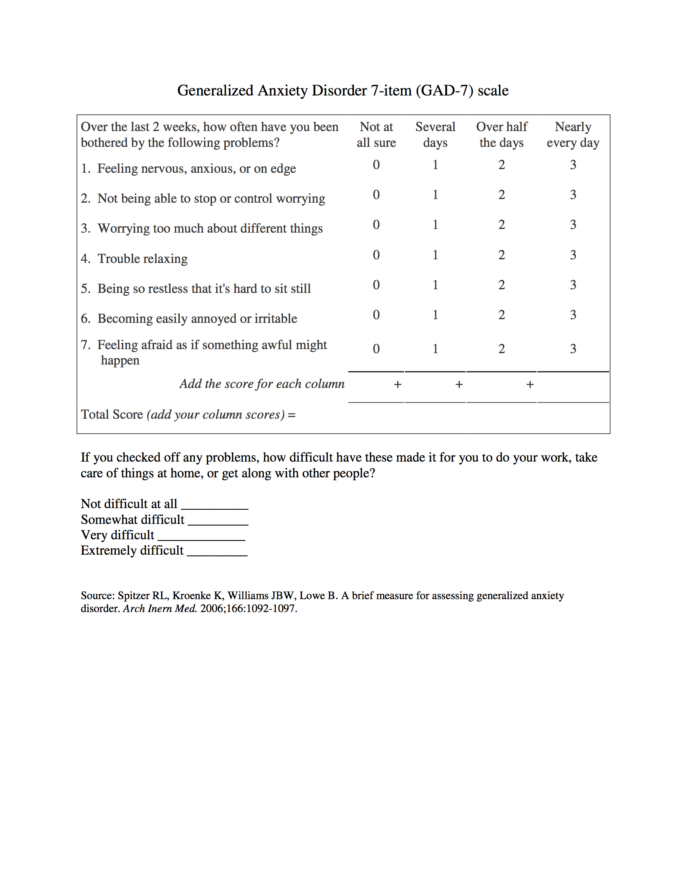

# Comparing `R` Substitution Solutions


## Background

When I started writing about methods for better ["parametric programming" interfaces for `dplyr`](http://www.win-vector.com/blog/2016/12/parametric-variable-names-and-dplyr/) for [`R`](https://www.r-project.org) [`dplyr`](http://dplyr.tidyverse.org) users in December of 2016 I encountered three divisions in the audience:

 * `dplyr` users who had such a need, and wanted such extensions.
 * `dplyr` users who did not have such a need ("we always know the column names").
 * `dplyr` users who found the then-current "underscore" and [`lazyeval`](https://cran.r-project.org/web/packages/lazyeval/index.html) system sufficient for the task.
 
Roughly I suggested two possible methods for making the task easier:

 * Renaming [views](https://en.wikipedia.org/wiki/View_(SQL)) for `data.frame`s.  I have now implemented the idea as a call-scoped concept in `replyr::replyr_apply_f_mapped()` ("call-scoped", meaning the re-mapping lasts for the duration of a function call).
 * Symbol re-binding by a block-scoped command called [`let()`](https://winvector.github.io/wrapr/reference/let.html) ([a common functional notation](https://en.wikipedia.org/wiki/Lisp_(programming_language)#Self-evaluating_forms_and_quoting); and "block-scoped" meaning the re-mapping lasts for the span of a code-block). I released this solution to `CRAN` and publicly announced it on [December 8 2016](http://www.win-vector.com/blog/2016/12/using-replyrlet-to-parameterize-dplyr-expressions/#comment-66361).
 
I mention dates to point out that this is something I have been inviting public comment on for some time. 

Things change.  Since the above time:

 * The development version of `dplyr` incorporated a new [`rlang`/`tidyeval`](https://github.com/tidyverse/rlang) package ([probably around February 14th 2017](https://github.com/tidyverse/dplyr/commit/7d34aea17cb6806992acb2b1cc59a5484148aa03)).
 * `rlang`/`tidyeval` was [released to CRAN on May 2017](https://cran.r-project.org/src/contrib/Archive/rlang/).  Obviously `rlang`/`tidyeval` had been under development for some time, but I don't the parametric aspect of it was publicly discussed much before [February 16, 2017](https://github.com/tidyverse/dplyr/issues/1600#issuecomment-280453923) (notice in this issue-note a formula centric interface is still being contemplated).
 * `dplyr` `0.7.0` was relesed, based on  `rlang`/`tidyeval` (June 9th, 2017).
 * `dplyr` excised direct use of `lazyeval`.
 * The `dplyr` "underscore verbs" (or methods) were all deprecated (i.e., no longer advised).
 
The `rlang`/`tidyeval` strategy is to capture un-evaluated user expressions (as a new object called a "[`quosure`](http://rlang.tidyverse.org/reference/quosure.html)") and [evaluate them with new language rules](http://rlang.tidyverse.org/reference/eval_tidy_.html) (with new bindings and something called an "`overscope`"). 
Also note the  `rlang`/`tidyeval` strategy is full integration or re-writing of packages in terms of `rlang`/`tidyeval`; this isn't something you mix-in or turn on or off.

Some points I think that have been under-represented in previous discussions include:

 * Not all `R` users consider themselves to be expert programmers (many are happy calling themselves analysts or statisticians).
 * `R` is often used in collaborative projects where there are varying levels of programming expertise.
 
The second point I think is particularly interesting.  It means:

> An `R` user who does not consider themselves an expert programmer could be maintaining code that they understand, but could not be expected to create from scratch.

Or:

> Let's have some sympathy for the part-time `R` user.

This is the point we will emphasize in our new example.


## The example

The design and discussion of substitution solutions should be driven from concrete realistic use cases.  Working from larger examples gives us a taste of what working with each solution is like in practice. So, let's pretend to discuss social science (instead of programming).

Suppose an analyst, psychologist, medical doctor, or scientist is building an assessment for some aspects behavior and anxiety.

Often such assessments involve selecting moving through a multiple-choice questionnaire and collecting a number of points that depend on answers selected. One such assessment is the [Generalized Anxiety Disorder 7 questionnaire](https://en.wikipedia.org/wiki/Generalized_Anxiety_Disorder_7) (or GAD-7).  It is a very simple system as can be seen below.

[](https://www.integration.samhsa.gov/clinical-practice/GAD708.19.08Cartwright.pdf)

One can treat such a test score as a classifier and [asses it](http://jamanetwork.com/journals/jamainternalmedicine/fullarticle/410326) in terms of sensitivity, specificity, and [different correspondence measures](http://www.win-vector.com/blog/2016/07/a-budget-of-classifier-evaluation-measures/).

An obvious extension of such tests is to give a different number of points in different categories for each multiple-choice answer. For example we could imagine such a test where each answer gave a varying number of points in one of two categories called "withdrawal behavior" and "positive re-framing" (both in the sense of [coping behaviors](https://en.wikipedia.org/wiki/Coping_(psychology))).

For example, our scientist might record the results of two subjects taking a test as follows:


```{r ex1}
d <- data.frame(
  subjectID = c(1,                   
                1,
                2,                   
                2),
  surveyCategory = c(
    'withdrawal behavior',
    'positive re-framing',
    'withdrawal behavior',
    'positive re-framing'
  ),
  assessmentTotal = c(5,                 
                      2,
                      3,                  
                      4),
  stringsAsFactors = FALSE
)
  
print(d)


# or in "wide form":
library("cdata")
moveValuesToColumns(d, 
                    columnToTakeKeysFrom = 'surveyCategory',
                    columnToTakeValuesFrom = 'assessmentTotal',
                    rowKeyColumns = 'subjectID')
```

A natural question is: how does one assign weights to each answer?  One way would be to administer the test to a number of people the experimenter has classified as having either of the above mentioned behaviors and then performing a [logistic regression](http://www.win-vector.com/blog/2011/09/the-simpler-derivation-of-logistic-regression/) to map assessment answers to the probability of a given diagnosis for this population.  By re-scaling the weights and rounding them to small integers we could have a test point system that is very close to performing a logistic regression classification.  We may be able to use the same assesment questions in a much more decisive manner than assigning all questions the same number of points.

This sort of idea is what one would expect from a mixed and collaborating team that includes medical experts, statistics experts, and programmers.  After some work our team might work out that scoring the assessment can be done by the simple `R` `dplyr` pipeline:

```{r known}
suppressPackageStartupMessages(library("dplyr"))

scale <- 0.237
  
d %>%
  group_by(subjectID) %>%
  mutate(probability =
           exp(assessmentTotal * scale)/
           sum(exp(assessmentTotal * scale)))
```

For each subject we take the row with maximal probability as the diagnosis.  The diagnosis was already obvious from the original scores, the main addition is the diagnosis confidence is now available as a probability estimate.

Each step of the above pipeline is learn-able:

 * The `group_by()` is arranging all rows associated with the same subject to work together in later calculations.
 * the `exp(assessmentTotal * scale)/sum(exp(assessmentTotal * scale))` is the classic "sigmoid link" from logistic regression.  It is the standard way (once you know it) of turning a free-score into a probability estimate.

Suppose this assessment is tested and works well. It is then plausible that the team might ask their `R` expert to help them construct a much more complicated `dplyr` pipeline that better formats the results.  Under the Harlan Mills' "Surgical Team" proposal (made famous in Frank Brook's [*The Mythical Man Month*](https://en.wikipedia.org/wiki/The_Mythical_Man-Month)) we expect effective data science teams to have a diversity of deep expertise (not everybody know everything, but a lot is known by the total team).  We expect a well staffed research team to include the statistician who worked out the sigmoid transform above, and a programmer who works out the pipeline we give below.

```{r known2}
d %>%
  group_by(subjectID) %>%
  mutate(probability =
           exp(assessmentTotal * scale)/
           sum(exp(assessmentTotal * scale))) %>%
  arrange(probability, surveyCategory) %>%
  mutate(isdiagnosis = row_number() == n()) %>%
  filter(isdiagnosis) %>%
  ungroup() %>%
  select(subjectID, surveyCategory, probability) %>%
  rename(diagnosis = surveyCategory) %>%
  arrange(subjectID)
```

This is indeed a long (and expert-level) pipeline.  But the principle is:

 * It does useful work (concentrates down to the rows we want and ensures good presentation column names and sorting).
 * While a part-time `R` user would not be expected to come up with it, they could (with cooperation from the pipeline author) understand all the steps and safely use the pipeline in their project.
 * The application (which we spent some time describing) is what the team cares about, the pipeline is a ends to a means (so even though it is long, it isn't often the central subject of interest).
 * The longer pipeline is paying the bills, and helping patients.  So some pain and cost are to be tolerated.
 
Let's take this deliberately long (so as to be a strong test) example and see how hard the pipeline is to re-use under different methodologies.  

## Re-use

An issue that comes up is: can the team re-use the pipeline on another project?  Suppose in their next project the ID column isn't "`subjectID`" but it is "`patientID`" (and so on).  Obviously they can copy and paste the original pipeline and change the names (which is not a bad practice for the first few re-uses). 

But once this procedure is going to be used many times it is a good idea to wrap it up or genericize it so it can be safely re-adapted (so the users can't accidentally forget to change one name one place).

I will now walk through a number of approaches to this in terms of how hard they are on the researcher.  We are assuming their `R` expert does the wrapping for them, but then must explain the concepts to the part-time `R` user so they truly understand and can maintain the tools they are using.

For our example we assume all the column names are coming from variables set somewhere else (in another `R` script, or coming from a spreadsheet that is read into `R`, or some other source).  The nature of the columns is constant from analysis to analysis, but the exact names used may vary. For our example the column names are:

```{r names}
idCol        <- "subjectID"
categoryCol  <- "surveyCategory"
linkScoreCol <- "assessmentTotal"
indicatorCol <- "rank"
probScoreCol <- "probability"
outcomeCol   <- "diagnosis"
```


### [`wrapr`](https://winvector.github.io/wrapr/index.html) solution

In my opinion the easiest solution (in terms of cognitive load) is [`wrapr::let()`](https://winvector.github.io/wrapr/reference/let.html).  The `R` expert would share the following code:

```{r let}
library("wrapr")

let(
  c(
    IDCOL        = idCol,
    CATEGORYCOL  = categoryCol,
    LINKSCORECOL = linkScoreCol,
    INDICATORCOL = indicatorCol,
    PROBSCORECOL = probScoreCol,
    OUTCOMECOL   = outcomeCol
  ),
  
  d %>%
    group_by(IDCOL) %>%
    mutate(PROBSCORECOL =
             exp(LINKSCORECOL * scale)/
             sum(exp(LINKSCORECOL * scale))) %>%
    arrange(PROBSCORECOL, CATEGORYCOL) %>%
    mutate(INDICATORCOL = row_number() == n()) %>%
    filter(INDICATORCOL) %>%
    ungroup() %>%
    select(IDCOL, CATEGORYCOL, PROBSCORECOL) %>%
    rename(OUTCOMECOL = CATEGORYCOL) %>%
    arrange(IDCOL)
)
```

The concept is:

> "`let()` works as if you had written the code with the names substituted as shown in the `c()` block."  

And there is [ample](https://winvector.github.io/wrapr/) documentation showing how this can be used.  Notice creating this code is completely mechanical (replace concrete names with the all-caps place holders) and the execution has an easy mental model (the place-holders are replaced with names stored in the variables).  

In this solution the adapted code looks like the original code.

### [`replyr`](https://winvector.github.io/replyr/index.html) solution

The next easiest method *in concept* is [`replyr_apply_f_mapped()`](https://winvector.github.io/replyr/reference/replyr_apply_f_mapped.html).

The `R` expert would write the following, and the part-time `R` user (with some coaching) could maintain it.

```{r replyrf}
library("replyr")

d %>%
  replyr_apply_f_mapped(
    nmap = c(
      IDCOL        = idCol,
      CATEGORYCOL  = categoryCol,
      LINKSCORECOL = linkScoreCol,
      INDICATORCOL = indicatorCol,
      PROBSCORECOL = probScoreCol,
      OUTCOMECOL   = outcomeCol
    ),
    
    f = . %>%
      group_by(IDCOL) %>%
      mutate(PROBSCORECOL =
               exp(LINKSCORECOL * scale)/
               sum(exp(LINKSCORECOL * scale))) %>%
      arrange(PROBSCORECOL, CATEGORYCOL) %>%
      mutate(INDICATORCOL = row_number() == n()) %>%
      filter(INDICATORCOL) %>%
      ungroup() %>%
      select(IDCOL, CATEGORYCOL, PROBSCORECOL) %>%
      rename(OUTCOMECOL = CATEGORYCOL) %>%
      arrange(IDCOL)
  )
```

What the code does is exactly this:

 * It renames all of the columns in the `data.frame` to have the chosen names (in this case the all-caps names).
 * It then applies the user-supplied function `f()` to this `data.frame`.
 * The reverse of the name-mapping is applied to the result of `f()`, moving columns back to their original names.
 
The concept is:

> `replyr_apply_f_mapped()` renames columns and back.
 
Below is an illustrative example showing the column names seen inside and outside the user supplied function.

```{r rmape}
print(colnames(d))
d %>%
  replyr_apply_f_mapped(
    nmap = c(
      IDCOL        = idCol,
      CATEGORYCOL  = categoryCol,
      LINKSCORECOL = linkScoreCol,
      INDICATORCOL = indicatorCol,
      PROBSCORECOL = probScoreCol,
      OUTCOMECOL   = outcomeCol
    ),
    
    f = function(df) {
      df$PROBSCORECOL <- 1
      print(colnames(df))
      return(df)
    }
  ) %>%
  colnames()
```

 
This is teachable and something the part-time `R` user can correctly extend and maintain.  Though the user may possibly need to learn about wrapping a pipeline as an anonymous function (the "`. %>%`" notation).


### [`rlang/tidyeval`](http://rlang.tidyverse.org) solution

For the `rlang`/`tidyeval` solution the expert writes the following code:

```{r tidyeval}
IDSYM        <- rlang::sym(idCol)
CATEGORYSYM  <- rlang::sym(categoryCol)
LINKSCORESYM <- rlang::sym(linkScoreCol)
INDICATORSYM <- rlang::sym(indicatorCol)
PROBSCORESYM <- rlang::sym(probScoreCol)
OUTCOMESYM   <- rlang::sym(outcomeCol)

d %>%
  group_by(!!IDSYM) %>%
  mutate(!!PROBSCORESYM :=
           exp((!!LINKSCORESYM) * scale)/
           sum(exp((!!LINKSCORESYM) * scale))) %>%
  arrange(!!PROBSCORESYM, !!CATEGORYSYM) %>%
  mutate(!!INDICATORSYM := row_number() == n()) %>%
  filter(!!INDICATORSYM) %>%
  ungroup() %>%
  select(!!IDSYM, !!CATEGORYSYM, !!PROBSCORESYM) %>%
  rename(!!OUTCOMESYM := !!CATEGORYSYM) %>%
  arrange(!!IDSYM)
```

Several points have to be taught to the part-time `R` user if this code is to be maintained:

 * The "`!!`" symbol does not have the same [operator precedence](https://stat.ethz.ch/R-manual/R-devel/library/base/html/Syntax.html) as an assignment symbols such as "`=`" or "`:=`", so you must often place "`!!`"-expressions in extra parentheses.
 * In any assignment we must use "`:=`" for assignment if we using "`!!`" on the left-hand side of the assignment.

The above are just some syntax edge-cases, we haven't even gone into teaching `rlang::sym()`, "`!!`", and the theory and semantics of quasi-quotation.

### [`seplyr`](https://winvector.github.io/seplyr/) solution

[`seplyr`](https://winvector.github.io/seplyr/index.html) is an experiment to see what a referentially transparent (or completely value oriented) interface to `dplyr` would look like.  Please don't think of `seplyr` as an adapter (though it is, it sends all work to `dplyr`), but as an illustration of what a completely value-oriented `dplyr` might look like (i.e., one that did not capture un-evaluated user code through non-standard evaluation).  Roughly `seplyr` is an experiment of the form: "what if one tried harder with something like the new `dplyr::*_at()` verbs."

Most of the `seplyr` methods are named `*_se()` and are designed to be very similar to their `dplyr` equivalents (and some are nearly identical to `dplyr::*_at()` methods, [`rename_se()`](https://winvector.github.io/seplyr/reference/rename_se.html) being a notable exception).


```{r seplyr}
library("seplyr")
suppressPackageStartupMessages(library("glue"))

d %>%
  group_by_se(idCol) %>%
  mutate_se(probScoreCol :=
           glue('exp({linkScoreCol} * scale)/
                  sum(exp({linkScoreCol} * scale))')) %>%
  arrange_se(c(probScoreCol, categoryCol)) %>% 
  mutate_se(indicatorCol := "row_number() == n()") %>%
  filter_se(indicatorCol) %>%
  ungroup() %>%
  select_se(c(idCol, categoryCol, probScoreCol)) %>%
  rename_se(outcomeCol := categoryCol) %>%
  arrange_se(idCol)
```

The concept is:

> "Only `mutate` *needs* [non-standard evaluation](http://adv-r.had.co.nz/Computing-on-the-language.html)."

`seplyr` accepts general expressions many more places, but with proper organization and using a few temp-columns you really only *need* the full generality in `mutate()`.

`seplyr` has its own issues:

 * It also needs a "[`:=`](https://winvector.github.io/seplyr/reference/named_map_builder.html)" operator for assignment.
 * It insists on multiple arguments coming in as vectors (hence the use of "`c()`" throughout).
 * It runs into a bit of trouble with verbs that take expressions (`mutate_se()` being the most complicated) in that it needs a helper to substitute in the name of the variable holding the column name, which is later substituted out for the actual column name by `seplyr`.  In this example we used `glue::glue()` to perform the substitution, but we could also try `paste0()` or `gsub()`.
 
However, for many verbs (`group_by_se()`, `arrange_se()`, `rename_se()`, and `select_se()`) the value oriented notation is in fact quite natural.  In these cases if our column names are in variables these verbs are very concise and really in no sense inferior to the `dplyr()` originals.

## Conclusion

A part-time `R` user will not have the background to quickly compare all of the available substitution systems.  In fact such a user will only come to needing a substitution system when they have a problem.  So by definition they are in in the middle of some other task.  So it is up to expert partners to evaluate explain alternatives.

There is a temptation that if you are going to only teach one system it might as well be `rlang`/`tidyeval` as "that is what now comes with `dplyr`".  I feel this is a false savings as while `rlang`/`tidyeval` "is already in `dplyr`" the `rlang`/`tidyeval` concepts are not "already in the user" (and in fact include a fairly number of irregular details, needing to be taught and memorized).

Our preference is: `wrapr::let()`.  `wrapr::let()` delivers a lot of (safe) power for a modest amount of cognitive load.  Each of the above systems involves different trade-offs and compromises, and we feel one must really try a few in production before being an expert.
