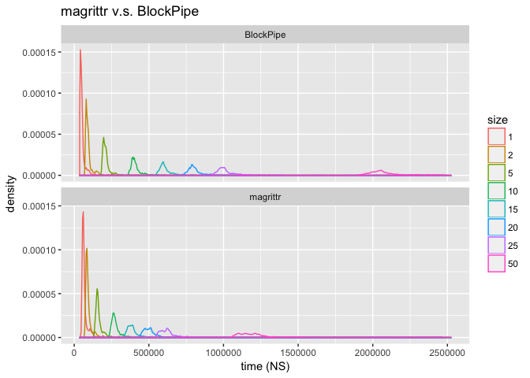

Some timings for [`%.>%`](http://www.win-vector.com/blog/2017/07/in-praise-of-syntactic-sugar/) ("dot arrow").

Keep in mind for any *serious* application the calculation time on data will far dominate any piping overhead, but it is fun to look.

So we will compare:

-   `magrittr*` `magrittr::%>%` piping.
-   `DotArrow*` `wrapr::%.>%` piping.
-   `BizarroPipe*` `->.;` piping.
-   `TidyPipe*` `%>%` [piping based on `rlang`/`tidyeval`](https://gist.github.com/lionel-/10cd649b31f11512e4aea3b7a98fe381) (renamed to "`%t>%`" in this run to avoid name collisions).

``` r
library("microbenchmark")
library("wrapr")
suppressPackageStartupMessages(library("ggplot2"))
suppressPackageStartupMessages(library("dplyr"))
source('rlangPipe.R')

# load generated examples
prevNames <- ls()
source("pGenFns.R")
genFns <- setdiff(ls(), c(prevNames, 'prevNames', 'genFns'))

# parser translates BizarroPipe to different code!
cat(buildFnsK(5), sep = '\n')
```

    ## magrittr_5 <- function() {
    ##  5 %>%
    ##    sin(.) %>%
    ##    sin(.) %>%
    ##    sin(.) %>%
    ##    sin(.) %>%
    ##    sin(.)
    ## }
    ## 
    ## 
    ## 
    ## DotArrow_5 <- function() {
    ##  5 %.>%
    ##    sin(.) %.>%
    ##    sin(.) %.>%
    ##    sin(.) %.>%
    ##    sin(.) %.>%
    ##    sin(.)
    ## }
    ## 
    ## 
    ## 
    ## BizarroPipe_5 <- function() {
    ##  5 ->.;
    ##    sin(.) ->.;
    ##    sin(.) ->.;
    ##    sin(.) ->.;
    ##    sin(.) ->.;
    ##    sin(.)
    ## }
    ## 
    ## 
    ## 
    ## TidyPipe_5 <- function() {
    ##  5 %t>%
    ##    sin(.) %t>%
    ##    sin(.) %t>%
    ##    sin(.) %t>%
    ##    sin(.) %t>%
    ##    sin(.)
    ## }

``` r
print(BizarroPipe_5)
```

    ## function () 
    ## {
    ##     . <- 5
    ##     . <- sin(.)
    ##     . <- sin(.)
    ##     . <- sin(.)
    ##     . <- sin(.)
    ##     sin(.)
    ## }

``` r
BizarroPipe_10()
```

    ## [1] -0.4774053

``` r
DotArrow_10()
```

    ## [1] -0.4774053

``` r
magrittr_10()
```

    ## [1] -0.4774053

``` r
# get expressions into a nice presentation order
fList <- data.frame(expr= genFns, 
                    stringsAsFactors = FALSE)
fList$size <- as.numeric(gsub("[^0-9]+", "", fList$expr))
fList$fn <- gsub("[_0-9].*$", "", fList$expr)
fList <- fList[order(fList$size, fList$fn), , drop=FALSE]

cmd <- parse(text=paste0(
  "microbenchmark(\n ",
  paste(paste0(fList$expr,'()'), collapse=',\n '),
  ", 
  times=1000L
  )\n"
))

print(cmd)
```

    ## expression(microbenchmark(BizarroPipe_1(), DotArrow_1(), magrittr_1(), 
    ##     TidyPipe_1(), BizarroPipe_2(), DotArrow_2(), magrittr_2(), 
    ##     TidyPipe_2(), BizarroPipe_5(), DotArrow_5(), magrittr_5(), 
    ##     TidyPipe_5(), BizarroPipe_10(), DotArrow_10(), magrittr_10(), 
    ##     TidyPipe_10(), BizarroPipe_15(), DotArrow_15(), magrittr_15(), 
    ##     TidyPipe_15(), BizarroPipe_20(), DotArrow_20(), magrittr_20(), 
    ##     TidyPipe_20(), BizarroPipe_25(), DotArrow_25(), magrittr_25(), 
    ##     TidyPipe_25(), BizarroPipe_50(), DotArrow_50(), magrittr_50(), 
    ##     TidyPipe_50(), BizarroPipe_100(), DotArrow_100(), magrittr_100(), 
    ##     TidyPipe_100(), BizarroPipe_200(), DotArrow_200(), magrittr_200(), 
    ##     TidyPipe_200(), BizarroPipe_500(), DotArrow_500(), magrittr_500(), 
    ##     TidyPipe_500(), BizarroPipe_1000(), DotArrow_1000(), magrittr_1000(), 
    ##     TidyPipe_1000(), times = 1000L))

``` r
bm <- eval(cmd)
print(bm)
```

    ## Unit: nanoseconds
    ##                expr       min          lq         mean      median
    ##     BizarroPipe_1()       222      1582.0 3.452462e+03      1891.0
    ##        DotArrow_1()      4235      8492.0 1.407039e+04     12240.5
    ##        magrittr_1()     56548     86874.5 1.279572e+05    117928.5
    ##        TidyPipe_1()     76276     98633.5 1.675330e+05    132375.5
    ##     BizarroPipe_2()       280      1654.5 3.956418e+03      1998.5
    ##        DotArrow_2()      7636     14224.0 2.357294e+04     18157.5
    ##        magrittr_2()     82207    125945.5 1.858265e+05    156135.0
    ##        TidyPipe_2()    152758    191140.5 2.946715e+05    258549.5
    ##     BizarroPipe_5()       427      2044.5 6.957985e+03      2424.0
    ##        DotArrow_5()     18651     28462.0 4.666124e+04     33913.0
    ##        magrittr_5()    153189    209923.0 2.875921e+05    247030.5
    ##        TidyPipe_5()    376903    452410.0 6.847440e+05    567618.0
    ##    BizarroPipe_10()       656      2268.5 1.219271e+04      2660.0
    ##       DotArrow_10()     37175     52872.5 8.188275e+04     61072.0
    ##       magrittr_10()    256265    337953.0 4.759854e+05    391870.0
    ##       TidyPipe_10()    731178    902174.0 1.278493e+06   1114632.0
    ##    BizarroPipe_15()       816      2577.5 1.380794e+04      3054.5
    ##       DotArrow_15()     55744     75206.0 1.214259e+05     86447.5
    ##       magrittr_15()    368810    474488.0 6.591939e+05    560907.5
    ##       TidyPipe_15()   1103447   1348655.0 1.844298e+06   1610747.0
    ##    BizarroPipe_20()       984      2617.0 1.723997e+04      3080.0
    ##       DotArrow_20()     78110     97314.0 1.591300e+05    111272.0
    ##       magrittr_20()    493245    603417.0 8.424960e+05    707362.0
    ##       TidyPipe_20()   1476766   1804012.0 2.502478e+06   2212604.0
    ##    BizarroPipe_25()      1148      2748.0 1.710645e+04      3219.0
    ##       DotArrow_25()     97539    120199.0 3.451899e+05    139810.0
    ##       magrittr_25()    612587    729494.0 1.018048e+06    849042.0
    ##       TidyPipe_25()   1860104   2245898.5 3.128991e+06   2691102.0
    ##    BizarroPipe_50()      2088      3864.0 3.247329e+04      4347.5
    ##       DotArrow_50()    185787    228443.5 3.833299e+05    269846.0
    ##       magrittr_50()   1163140   1391384.5 1.979434e+06   1743553.5
    ##       TidyPipe_50()   3834891   4496058.5 6.145512e+06   5551208.5
    ##   BizarroPipe_100()      3894      5720.5 5.512375e+04      6289.0
    ##      DotArrow_100()    368637    464721.5 7.647731e+05    545108.5
    ##      magrittr_100()   2278879   2716829.5 3.830687e+06   3432310.0
    ##      TidyPipe_100()   7955880   9568530.0 1.246797e+07  11335954.5
    ##   BizarroPipe_200()      7228      9556.0 1.518077e+05     10172.5
    ##      DotArrow_200()    799396    971421.5 1.666996e+06   1219153.0
    ##      magrittr_200()   4514391   5386501.5 7.505771e+06   6731385.5
    ##      TidyPipe_200()  17018582  20802727.0 2.604228e+07  23803872.5
    ##   BizarroPipe_500()     17972     21193.0 2.695247e+05     21877.0
    ##      DotArrow_500()   2246279   2642707.5 3.930794e+06   3393110.5
    ##      magrittr_500()  11255617  14287600.0 1.878876e+07  17276868.5
    ##      TidyPipe_500()  53018221  62306566.5 7.456054e+07  68059408.0
    ##  BizarroPipe_1000()     35239     40296.0 6.376164e+05     41190.5
    ##     DotArrow_1000()   4759151   5573930.5 7.693530e+06   7097855.5
    ##     magrittr_1000()  22968508  30391914.0 3.654468e+07  34176933.5
    ##     TidyPipe_1000() 136980863 159031345.0 1.872716e+08 170789519.0
    ##           uq       max neval
    ##       2286.5   1335223  1000
    ##      14385.5   1483981  1000
    ##     142626.5   1601727  1000
    ##     198904.5   3120480  1000
    ##       2518.0   1746211  1000
    ##      21189.5   4114697  1000
    ##     192439.0   4319166  1000
    ##     337986.0   3627811  1000
    ##       2862.0   4375198  1000
    ##      41358.0   7056578  1000
    ##     302484.5   5217226  1000
    ##     709918.5  15174794  1000
    ##       3125.5   9313475  1000
    ##      78833.0  10292974  1000
    ##     502077.5   7785130  1000
    ##    1330135.0  21690383  1000
    ##       3548.0  10558228  1000
    ##     121341.0  12071787  1000
    ##     704158.0  15340941  1000
    ##    2001477.5  16865493  1000
    ##       3620.5  13891002  1000
    ##     160222.5  18337023  1000
    ##     892130.0  16085216  1000
    ##    2721419.5  22493574  1000
    ##       3721.0  13632091  1000
    ##     198674.0  66959653  1000
    ##    1105683.0  25587557  1000
    ##    3379793.5  38394790  1000
    ##       4887.5  27723503  1000
    ##     408221.5  39499899  1000
    ##    2145652.5  36355000  1000
    ##    6682996.5 113465897  1000
    ##       6992.5  48416926  1000
    ##     794134.5  68960836  1000
    ##    4171484.5  80601790  1000
    ##   13348474.0  95914483  1000
    ##      11302.5 140506945  1000
    ##    1728131.5 168082935  1000
    ##    8227618.5 158384845  1000
    ##   27896518.5 194058884  1000
    ##      23802.0 245494557  1000
    ##    4477422.5  72862524  1000
    ##   20451439.0  84597931  1000
    ##   80624399.5 275116564  1000
    ##      45777.0 591202114  1000
    ##    8997457.0  24598222  1000
    ##   39256910.5 116671289  1000
    ##  201818703.0 754698628  1000

``` r
autoplot(bm)
```


``` r
d <- as.data.frame(bm)
d$size <- as.numeric(gsub("[^0-9]+", "", d$expr))
d$fn <- gsub("[_0-9].*$", "", d$expr)

d$fn <- reorder(d$fn, d$time)
ggplot(d, aes(x=fn, y=time, color=fn)) + 
  geom_violin() + 
  scale_y_log10() + 
  facet_wrap(~size, labeller="label_both") + 
  coord_flip() + 
  xlab("method") +
  ylab("time NS") +
  theme(legend.position = 'none') +
  scale_color_manual(values = colorAssignment) +
  ggtitle("distribution of runtime as function of method and problem size",
          subtitle = "log-time scale")
```


``` r
# ggplot 2 legend in reverse order, so re-order to get that
d$fn <- reorder(d$fn, -d$time)
ggplot(d, aes(x=size, y=time, color=fn)) +
  geom_smooth() +
  scale_y_log10() +
  scale_x_log10() +
  scale_color_manual(values = colorAssignment) +
  xlab('size (number of pipe stages)') +
  ylab("time NS") +
  ggtitle("complexity of runtime as function of method and problem size",
          subtitle = "log/log scale")
```

    ## `geom_smooth()` using method = 'gam'



``` r
# verb that adds a name column to a list of dataframes
add_name_column <- function(dlist, destinationColumn) {
  res <- dlist
  for(ni in names(dlist)) {
    vi <- dlist[[ni]]
    vi[[destinationColumn]] <- ni
    res[[ni]] <- vi
  }
  res
}

# fit a linear function for runtime as a function of size
# per group.
dfits <- d %.>%
  split(., .$fn) %.>%
  lapply(., 
         function(di) { 
           mi <- lm(time ~ size + I(size*size), data=di) 
           ctab <- as.data.frame(summary(mi)$coefficients)
           ctab$coef <- rownames(ctab)
           ctab
         }) %.>%
  add_name_column(., 'method') %.>%
  bind_rows(.) %.>%
  arrange(., method, coef) %.>%
  select(.,  method, coef, Estimate, `Std. Error`, `Pr(>|t|)`)

# "Intercept" is roughly start-up cost 
# "size" is roughly the slope or growth rate of execution time
# as a function of number of pipe stages.
# "I(size * size)" is where we try to detect super-linear cost,
# check that it is both statistically significant and that 
# it has a size that would affect predictions (is it times
# the typical variation in size*size large?).
print(dfits)
```

    ##         method           coef      Estimate   Std. Error      Pr(>|t|)
    ## 1  BizarroPipe    (Intercept)   7089.177277 7.002188e+04  9.193598e-01
    ## 2  BizarroPipe I(size * size)      0.114784 7.598874e-01  8.799357e-01
    ## 3  BizarroPipe           size    511.683161 7.320178e+02  4.845632e-01
    ## 4     DotArrow    (Intercept)  16424.650474 2.619331e+04  5.306350e-01
    ## 5     DotArrow I(size * size)     -0.382053 2.842535e-01  1.789553e-01
    ## 6     DotArrow           size   8056.229955 2.738283e+02 9.135169e-184
    ## 7     magrittr    (Intercept)  79298.841997 4.877012e+04  1.039819e-01
    ## 8     magrittr I(size * size)     -1.535420 5.292602e-01  3.725684e-03
    ## 9     magrittr           size  38017.042084 5.098491e+02  0.000000e+00
    ## 10    TidyPipe    (Intercept) 228370.531506 1.821491e+05  2.099551e-01
    ## 11    TidyPipe I(size * size)     75.015638 1.976708e+00 1.015945e-297
    ## 12    TidyPipe           size 111948.800704 1.904210e+03  0.000000e+00

A note on the rare very slow events with `Bizarro Pipe`. My *guess* is given `Bizarro Pipe` is the only pipe that gets translated into a multi-line/multi-statement/many-visible-assigments function (i.e., more than one expression) that possibly gives it more changes to win the "garbage collection lottery" and pay for everybody's object clean-up. I don't actually know `R`'s `gc()` trigger strategy, so this is just speculation on my part.
