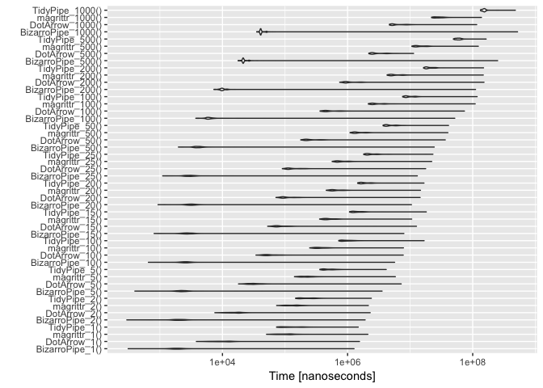
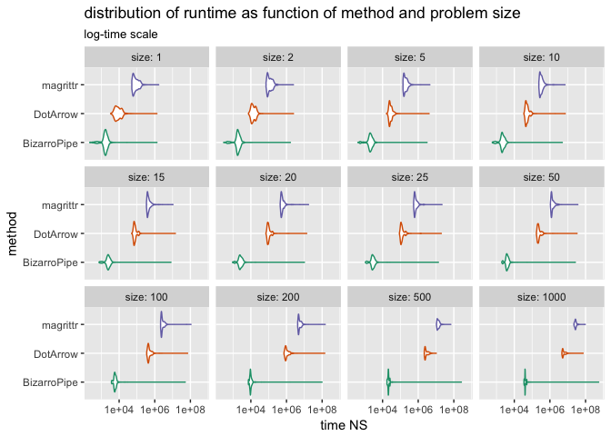

Some timings for [`%.>%`](http://www.win-vector.com/blog/2017/07/in-praise-of-syntactic-sugar/) ("dot arrow").

Keep in mind for any *serious* application the calculation time on data will far dominate any piping overhead, but it is fun to look.

So we will compare:

-   `magrittr*` `magrittr::%>%` substitution.
-   `DotArrow*` `wrapr::%.>%` substitution.
-   `HappyArrow*` `wrapr::%:>%` substitution.
-   `BizarroPipe*` `->.;` substitution.

``` r
library("microbenchmark")
library("wrapr")
library("rlang")
suppressPackageStartupMessages(library("ggplot2"))
suppressPackageStartupMessages(library("dplyr"))

# load generated examples
prevNames <- ls()
source("pGenFns.R")
genFns <- setdiff(ls(), c(prevNames, 'prevNames', 'genFns'))

print(BizarroPipe_5)
```

    ## function () 
    ## {
    ##     . <- 5
    ##     . <- sin(.)
    ##     . <- sin(.)
    ##     . <- sin(.)
    ##     . <- sin(.)
    ##     sin(.)
    ## }

``` r
print(DotArrow_5)
```

    ## function () 
    ## {
    ##     5 %.>% sin(.) %.>% sin(.) %.>% sin(.) %.>% sin(.) %.>% sin(.)
    ## }

``` r
print(HappyArrow_5)
```

    ## function () 
    ## {
    ##     5 %:>% sin(.) %:>% sin(.) %:>% sin(.) %:>% sin(.) %:>% sin(.)
    ## }

``` r
print(magrittr_5)
```

    ## function () 
    ## {
    ##     5 %>% sin(.) %>% sin(.) %>% sin(.) %>% sin(.) %>% sin(.)
    ## }

``` r
BizarroPipe_10()
```

    ## [1] -0.4774053

``` r
DotArrow_10()
```

    ## [1] -0.4774053

``` r
HappyArrow_10()
```

    ## [1] -0.4774053

``` r
magrittr_10()
```

    ## [1] -0.4774053

``` r
cmd <- parse(text=paste0(
  "microbenchmark(\n ",
  paste(paste0(genFns,'()'), collapse=',\n '),
  ", 
  times=1000L
  )\n"
))

print(cmd)
```

    ## expression(microbenchmark(BizarroPipe_1(), BizarroPipe_10(), 
    ##     BizarroPipe_15(), BizarroPipe_2(), BizarroPipe_20(), BizarroPipe_25(), 
    ##     BizarroPipe_5(), BizarroPipe_50(), DotArrow_1(), DotArrow_10(), 
    ##     DotArrow_15(), DotArrow_2(), DotArrow_20(), DotArrow_25(), 
    ##     DotArrow_5(), DotArrow_50(), HappyArrow_1(), HappyArrow_10(), 
    ##     HappyArrow_15(), HappyArrow_2(), HappyArrow_20(), HappyArrow_25(), 
    ##     HappyArrow_5(), HappyArrow_50(), magrittr_1(), magrittr_10(), 
    ##     magrittr_15(), magrittr_2(), magrittr_20(), magrittr_25(), 
    ##     magrittr_5(), magrittr_50(), times = 1000L))

``` r
bm <- eval(cmd)
print(bm)
```

    ## Unit: nanoseconds
    ##              expr     min        lq        mean    median        uq
    ##   BizarroPipe_1()     219     854.5    2396.738    1335.5    1558.0
    ##  BizarroPipe_10()     599    1375.5    6951.303    1969.5    2264.5
    ##  BizarroPipe_15()     770    1530.5    9547.461    2220.0    2533.0
    ##   BizarroPipe_2()     291    1085.0    3036.516    1589.5    1850.5
    ##  BizarroPipe_20()     928    1749.0   12081.935    2579.5    2925.0
    ##  BizarroPipe_25()    1118    2033.5   14115.822    2589.0    2883.0
    ##   BizarroPipe_5()     431    1189.0    4454.888    1813.0    2062.0
    ##  BizarroPipe_50()    1971    2718.5   26603.282    3613.0    4009.5
    ##      DotArrow_1()   14792   18965.0   26966.131   21843.5   25352.5
    ##     DotArrow_10()  158036  174492.0  200826.744  180208.5  187416.5
    ##     DotArrow_15()  236686  261108.0  296303.374  269306.5  277725.0
    ##      DotArrow_2()   30547   36321.5   43756.767   39519.5   43542.5
    ##     DotArrow_20()  321208  348896.0  412709.884  359119.5  370147.5
    ##     DotArrow_25()  407753  439881.5  507356.389  451640.5  464712.0
    ##      DotArrow_5()   78075   88324.5  106562.644   92206.5   97044.0
    ##     DotArrow_50()  855251  918948.5 1039469.992  937088.0  970670.5
    ##    HappyArrow_1()    3415    5470.5   10004.580    6348.5    7308.0
    ##   HappyArrow_10()   33961   41622.0   54434.667   44163.0   47009.5
    ##   HappyArrow_15()   49603   60881.0   76837.876   64746.5   68717.0
    ##    HappyArrow_2()    6654    9691.5   13235.418   10761.0   12003.0
    ##   HappyArrow_20()   67085   80126.5  104575.937   84594.0   89921.0
    ##   HappyArrow_25()   85468   98571.0  127915.475  103951.5  110563.0
    ##    HappyArrow_5()   16986   21961.5   27871.488   23526.5   25252.5
    ##   HappyArrow_50()  170499  191100.0  252426.560  201439.5  213754.0
    ##      magrittr_1()   50701   57643.0   66204.683   60550.5   65874.0
    ##     magrittr_10()  268552  292432.0  328218.060  305347.0  317063.0
    ##     magrittr_15()  387991  423912.0  530886.359  442963.5  456914.5
    ##      magrittr_2()   76781   85749.0   99405.758   88965.0   94852.5
    ##     magrittr_20()  507701  554038.5  622958.592  580926.0  601569.0
    ##     magrittr_25()  627518  680036.0  777407.011  715958.5  746620.5
    ##      magrittr_5()  148554  164811.5  191186.342  170308.0  178021.5
    ##     magrittr_50() 1229156 1356252.5 1512116.535 1426014.5 1484046.0
    ##       max neval
    ##   1135425  1000
    ##   5037144  1000
    ##   7449517  1000
    ##   1557817  1000
    ##   9628148  1000
    ##  11614868  1000
    ##   2778736  1000
    ##  23112814  1000
    ##   1334617  1000
    ##   6781564  1000
    ##  10414838  1000
    ##   1848686  1000
    ##  13426443  1000
    ##  18032134  1000
    ##   3662404  1000
    ##  33431304  1000
    ##   1798378  1000
    ##   6537602  1000
    ##   9956760  1000
    ##   1859639  1000
    ##  14609411  1000
    ##  19281942  1000
    ##   3696006  1000
    ##  37381755  1000
    ##   1453093  1000
    ##   7047150  1000
    ##  54377855  1000
    ##   2041006  1000
    ##  13171163  1000
    ##  17046114  1000
    ##   3766932  1000
    ##  33031920  1000

``` r
autoplot(bm)
```



``` r
d <- as.data.frame(bm)
d$size <- as.numeric(gsub("[^0-9]+", "", d$expr))
d$fn <- gsub("[_0-9].*$", "", d$expr)

d$fn <- reorder(d$fn, d$time)
ggplot(d, aes(x=fn, y=time, color=fn)) + 
  geom_violin() + 
  scale_y_log10() + 
  facet_wrap(~size, labeller="label_both") + 
  coord_flip() + 
  xlab("method") +
  ylab("time NS") +
  theme(legend.position = 'none') +
  scale_color_brewer(palette = 'Dark2') +
  ggtitle("distribution of runtime as function of method and problem size",
          subtitle = "log scale")
```



``` r
# new verb that records listnames in a column
bind_rows_named <- function(dlist, destinationColumn) {
  res <- bind_rows(dlist)
  res[[destinationColumn]] <- names(dlist)
  res
}

# fit a linear function for runtime as a function of size
# per group.
dfits <- d %.>%
  split(., .$fn) %.>%
  lapply(., 
         function(di) { 
           lm(time ~ size, data=di) 
         }) %.>%
  lapply(., coefficients) %.>%
  lapply(., 
         function(ri) {
           data.frame(Intercept= ri[["(Intercept)"]],
                      size= ri[['size']])
         }) %.>%
  bind_rows_named(., 'fn')


# "Intercept" is roughly start-up cost 
# "size" is slope or growth rate
print(dfits)
```

    ##   Intercept       size          fn
    ## 1  2028.097   491.8998 BizarroPipe
    ## 2  3878.695  4970.8784  HappyArrow
    ## 3 -1485.155 20670.5716    DotArrow
    ## 4 45196.701 29428.2010    magrittr

``` r
ratio <- dfits$size[dfits$fn=='magrittr'] / dfits$size[dfits$fn=='DotArrow']
print(ratio)
```

    ## [1] 1.423676

Overall:

DotArrow is about 1.4 times faster than magrittr on large pipelines, though this cost will be unnoticeable with in any significant workload.
