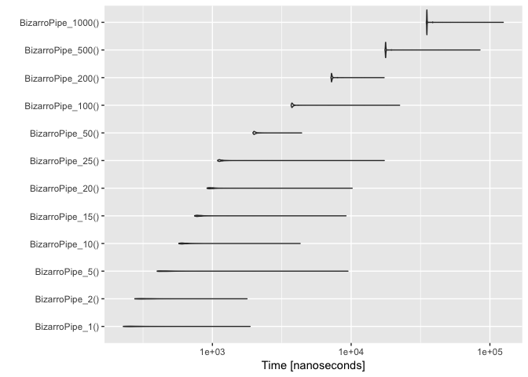

Some timings for [`%.>%`](http://www.win-vector.com/blog/2017/07/in-praise-of-syntactic-sugar/) ("dot arrow").

Keep in mind for any *serious* application the calculation time on data will far dominate any piping overhead, but it is fun to look.

So we will compare:

-   `magrittr*` `magrittr::%>%` piping.
-   `DotArrow*` `wrapr::%.>%` piping.
-   `BizarroPipe*` `->.;` piping.
-   `TidyPipe*` `%>%` [piping based on `rlang`/`tidyeval`](https://gist.github.com/lionel-/10cd649b31f11512e4aea3b7a98fe381) (renamed to "`%t>%`" in this run to avoid name collisions).

``` r
library("microbenchmark")
library("wrapr")
suppressPackageStartupMessages(library("ggplot2"))
suppressPackageStartupMessages(library("dplyr"))
library("glmnet")
```

    ## Loading required package: Matrix

    ## Loading required package: foreach

    ## Loaded glmnet 2.0-10

``` r
source('rlangPipe.R')

# load generated examples
prevNames <- ls()
source("pGenFns.R")
genFns <- setdiff(ls(), c(prevNames, 'prevNames', 'genFns'))

# parser translates BizarroPipe to different code!
cat(buildFnsK(5), sep = '\n')
```

    ## magrittr_5 <- function() {
    ##  5 %>%
    ##    sin(.) %>%
    ##    sin(.) %>%
    ##    sin(.) %>%
    ##    sin(.) %>%
    ##    sin(.)
    ## }
    ## 
    ## 
    ## 
    ## DotArrow_5 <- function() {
    ##  5 %.>%
    ##    sin(.) %.>%
    ##    sin(.) %.>%
    ##    sin(.) %.>%
    ##    sin(.) %.>%
    ##    sin(.)
    ## }
    ## 
    ## 
    ## 
    ## BizarroPipe_5 <- function() {
    ##  5 ->.;
    ##    sin(.) ->.;
    ##    sin(.) ->.;
    ##    sin(.) ->.;
    ##    sin(.) ->.;
    ##    sin(.)
    ## }
    ## 
    ## 
    ## 
    ## TidyPipe_5 <- function() {
    ##  5 %t>%
    ##    sin(.) %t>%
    ##    sin(.) %t>%
    ##    sin(.) %t>%
    ##    sin(.) %t>%
    ##    sin(.)
    ## }

``` r
print(BizarroPipe_5)
```

    ## function () 
    ## {
    ##     . <- 5
    ##     . <- sin(.)
    ##     . <- sin(.)
    ##     . <- sin(.)
    ##     . <- sin(.)
    ##     sin(.)
    ## }

``` r
BizarroPipe_10()
```

    ## [1] -0.4774053

``` r
DotArrow_10()
```

    ## [1] -0.4774053

``` r
magrittr_10()
```

    ## [1] -0.4774053

``` r
# get expressions into a nice presentation order
fList <- data.frame(expr= genFns, 
                    stringsAsFactors = FALSE)
fList$size <- as.numeric(gsub("[^0-9]+", "", fList$expr))
fList$fn <- gsub("[_0-9].*$", "", fList$expr)
fList <- fList[order(fList$size, fList$fn), , drop=FALSE]

cmd <- parse(text=paste0(
  "microbenchmark(\n ",
  paste(paste0(fList$expr,'()'), collapse=',\n '),
  ", 
  times=1000L
  )\n"
))

print(cmd)
```

    ## expression(microbenchmark(BizarroPipe_1(), DotArrow_1(), magrittr_1(), 
    ##     TidyPipe_1(), BizarroPipe_2(), DotArrow_2(), magrittr_2(), 
    ##     TidyPipe_2(), BizarroPipe_5(), DotArrow_5(), magrittr_5(), 
    ##     TidyPipe_5(), BizarroPipe_10(), DotArrow_10(), magrittr_10(), 
    ##     TidyPipe_10(), BizarroPipe_15(), DotArrow_15(), magrittr_15(), 
    ##     TidyPipe_15(), BizarroPipe_20(), DotArrow_20(), magrittr_20(), 
    ##     TidyPipe_20(), BizarroPipe_25(), DotArrow_25(), magrittr_25(), 
    ##     TidyPipe_25(), BizarroPipe_50(), DotArrow_50(), magrittr_50(), 
    ##     TidyPipe_50(), BizarroPipe_100(), DotArrow_100(), magrittr_100(), 
    ##     TidyPipe_100(), BizarroPipe_200(), DotArrow_200(), magrittr_200(), 
    ##     TidyPipe_200(), BizarroPipe_500(), DotArrow_500(), magrittr_500(), 
    ##     TidyPipe_500(), BizarroPipe_1000(), DotArrow_1000(), magrittr_1000(), 
    ##     TidyPipe_1000(), times = 1000L))

``` r
bm <- eval(cmd)
print(bm)
```

    ## Unit: nanoseconds
    ##                expr       min          lq         mean      median
    ##     BizarroPipe_1()       256      1615.0 3.192484e+03      1825.5
    ##        DotArrow_1()      3637      7481.5 1.263640e+04     11613.0
    ##        magrittr_1()     51069     71147.0 1.070230e+05    106340.5
    ##        TidyPipe_1()     74490     89893.0 2.431539e+05    114490.0
    ##     BizarroPipe_2()       357      1628.0 3.766533e+03      1904.0
    ##        DotArrow_2()      6924     12427.5 1.859578e+04     16817.5
    ##        magrittr_2()     75423     99747.5 1.434201e+05    137132.5
    ##        TidyPipe_2()    146635    171530.5 2.290960e+05    209813.0
    ##     BizarroPipe_5()       481      1980.0 5.619438e+03      2302.0
    ##        DotArrow_5()     17834     25026.5 3.657069e+04     29377.5
    ##        magrittr_5()    139718    175026.0 2.297319e+05    217663.0
    ##        TidyPipe_5()    364502    418537.0 5.186365e+05    487692.5
    ##    BizarroPipe_10()       593      2218.5 9.377049e+03      2601.0
    ##       DotArrow_10()     34859     47145.5 7.013821e+04     53036.5
    ##       magrittr_10()    246990    296851.5 3.740964e+05    336217.5
    ##       TidyPipe_10()    722505    813783.0 9.730012e+05    891414.5
    ##    BizarroPipe_15()       802      2337.5 1.499844e+04      2697.5
    ##       DotArrow_15()     50773     68696.0 9.256872e+04     74612.5
    ##       magrittr_15()    341807    421517.5 5.444699e+05    465411.5
    ##       TidyPipe_15()   1076303   1217650.5 1.460480e+06   1309399.5
    ##    BizarroPipe_20()       993      2707.5 1.292659e+04      3053.0
    ##       DotArrow_20()     70635     89163.5 1.253219e+05     96330.5
    ##       magrittr_20()    451143    538900.5 6.733380e+05    591937.5
    ##       TidyPipe_20()   1452405   1630999.5 1.943026e+06   1741798.0
    ##    BizarroPipe_25()      1138      2664.5 1.574394e+04      3016.5
    ##       DotArrow_25()     89358    108186.5 1.670622e+05    117466.5
    ##       magrittr_25()    560335    657390.0 8.388829e+05    716901.0
    ##       TidyPipe_25()   1815905   2037106.0 2.417820e+06   2169047.5
    ##    BizarroPipe_50()      2037      3745.0 3.088958e+04      4132.5
    ##       DotArrow_50()    174630    207632.0 3.221167e+05    224876.5
    ##       magrittr_50()   1094121   1246193.0 1.586008e+06   1344659.0
    ##       TidyPipe_50()   3653880   4093551.5 5.065353e+06   4336429.5
    ##   BizarroPipe_100()      3732      5727.0 6.735199e+04      6142.5
    ##      DotArrow_100()    347659    417946.5 6.344029e+05    452932.0
    ##      magrittr_100()   2087642   2435133.0 3.278632e+06   2614943.0
    ##      TidyPipe_100()   7648418   8485151.0 9.819652e+06   8985248.5
    ##   BizarroPipe_200()      7247      9318.0 1.346036e+05      9802.5
    ##      DotArrow_200()    705073    871457.0 1.280340e+06    936726.5
    ##      magrittr_200()   4150802   4842296.5 6.078607e+06   5233604.5
    ##      TidyPipe_200()  16393443  17980594.5 2.072715e+07  19139955.0
    ##   BizarroPipe_500()     17766     21082.0 3.184940e+05     21594.5
    ##      DotArrow_500()   2161012   2413966.5 3.072166e+06   2576519.5
    ##      magrittr_500()  10774015  12223250.0 1.485405e+07  13259145.0
    ##      TidyPipe_500()  49385605  54315471.0 5.949916e+07  58385123.0
    ##  BizarroPipe_1000()     35216     40031.0 7.066517e+05     40623.0
    ##     DotArrow_1000()   4579572   5061779.0 6.357852e+06   5372447.0
    ##     magrittr_1000()  21709287  24809887.5 2.904306e+07  27935901.0
    ##     TidyPipe_1000() 130058806 140882253.0 1.488110e+08 148625313.5
    ##           uq       max neval
    ##       2111.0   1332888  1000
    ##      13379.5   1750491  1000
    ##     125599.0   1818718  1000
    ##     176617.0 105414055  1000
    ##       2248.0   1844480  1000
    ##      18996.0   2291187  1000
    ##     156628.0   2101773  1000
    ##     263912.5   2733385  1000
    ##       2616.0   3327978  1000
    ##      34149.5   4526580  1000
    ##     250940.5   4426729  1000
    ##     557284.0   4304524  1000
    ##       2960.0   6779427  1000
    ##      61919.5   7728807  1000
    ##     388290.5   8345992  1000
    ##    1062059.0   8237483  1000
    ##       3039.5  12311071  1000
    ##      87538.5  10930753  1000
    ##     551094.0  16254991  1000
    ##    1617975.0  17488666  1000
    ##       3449.5   9865275  1000
    ##     115385.0  15168970  1000
    ##     720515.0  14515395  1000
    ##    2160344.5  19616299  1000
    ##       3385.5  12716535  1000
    ##     138167.0  30863605  1000
    ##     877055.5  20540004  1000
    ##    2643379.5  22947411  1000
    ##       4613.5  26716825  1000
    ##     305422.5  40690144  1000
    ##    1748924.0  50784806  1000
    ##    5482903.5 110405241  1000
    ##       6742.0  61080420  1000
    ##     636998.5  80945619  1000
    ##    3427110.0 111546489  1000
    ##   11097503.5  85169594  1000
    ##      10517.0 124513916  1000
    ##    1330871.5 156119065  1000
    ##    6893305.5 194743302  1000
    ##   22308988.0 185766829  1000
    ##      22639.5 296028455  1000
    ##    3772038.0  19831350  1000
    ##   16635142.0 121523713  1000
    ##   62459526.5 163896351  1000
    ##      42482.5 664177613  1000
    ##    7787508.5  23992776  1000
    ##   32278521.0 130573433  1000
    ##  154210217.5 261977739  1000

``` r
autoplot(bm)
```


``` r
d <- as.data.frame(bm)
d$size <- as.numeric(gsub("[^0-9]+", "", d$expr))
d$fn <- gsub("[_0-9].*$", "", d$expr)

d$fn <- reorder(d$fn, d$time)
ggplot(d, aes(x=fn, y=time, color=fn)) + 
  geom_violin() + 
  scale_y_log10() + 
  facet_wrap(~size, labeller="label_both") + 
  coord_flip() + 
  xlab("method") +
  ylab("time NS") +
  theme(legend.position = 'none') +
  scale_color_manual(values = colorAssignment) +
  ggtitle("distribution of runtime as function of method and problem size",
          subtitle = "log-time scale")
```


``` r
# ggplot 2 legend in reverse order, so re-order to get that
d$fn <- reorder(d$fn, -d$time)
ggplot(d, aes(x=size, y=time, color=fn)) +
  geom_smooth() +
  scale_y_log10() +
  scale_x_log10() +
  scale_color_manual(values = colorAssignment) +
  xlab('size (number of pipe stages)') +
  ylab("time NS") +
  ggtitle("complexity of runtime as function of method and problem size",
          subtitle = "log/log scale")
```

    ## `geom_smooth()` using method = 'gam'


``` r
# fit a linear function for runtime as a function of size
# per group.
dfits <- d %.>%
  split(., .$fn) %.>%
  lapply(., 
         function(di) { 
           mi <- lm(time ~ size + I(size*size), data=di) 
           ctab <- as.data.frame(summary(mi)$coefficients)
           ctab$coef <- rownames(ctab)
           ctab
         }) %.>%
  add_name_column(., 'method') %.>%
  bind_rows(.) %.>%
  arrange(., method, coef) %.>%
  select(.,  method, coef, Estimate, `Std. Error`, `Pr(>|t|)`)

# "Intercept" is roughly start-up cost 
# "size" is roughly the slope or growth rate of execution time
# as a function of number of pipe stages.
# "I(size * size)" is where we try to detect super-linear cost,
# check that it is both statistically significant and that 
# it has a size that would affect predictions (is it times
# the typical variation in size*size large?).
print(dfits)
```

    ##         method           coef      Estimate   Std. Error      Pr(>|t|)
    ## 1  BizarroPipe    (Intercept)  3.659123e+03 7.883748e+04  9.629815e-01
    ## 2  BizarroPipe I(size * size)  1.173197e-01 8.555555e-01  8.909327e-01
    ## 3  BizarroPipe           size  5.844061e+02 8.241772e+02  4.782897e-01
    ## 4     DotArrow    (Intercept)  1.299926e+04 2.115258e+04  5.388655e-01
    ## 5     DotArrow I(size * size)  2.980349e-01 2.295508e-01  1.941956e-01
    ## 6     DotArrow           size  6.040031e+03 2.211318e+02 2.042749e-159
    ## 7     magrittr    (Intercept)  9.352299e+04 4.322001e+04  3.049308e-02
    ## 8     magrittr I(size * size) -1.335007e+00 4.690296e-01  4.430314e-03
    ## 9     magrittr           size  3.027475e+04 4.518275e+02  0.000000e+00
    ## 10    TidyPipe    (Intercept)  1.637472e+05 6.747282e+04  1.524472e-02
    ## 11    TidyPipe I(size * size)  5.889391e+01 7.322247e-01  0.000000e+00
    ## 12    TidyPipe           size  8.970535e+04 7.053696e+02  0.000000e+00

``` r
# re-run with non-negative least squares

dfitsnn <- d %.>%
  split(., .$fn) %.>%
  lapply(., 
         function(di) { 
           di$sizesq <- (di$size)^2
           mi <- glmnet(as.matrix(di[, c('size', 'sizesq')]), 
                        di$time, 
                        lower.limits = 0, 
                        alpha=0.1, 
                        lambda=1.e-5,
                        intercept = TRUE, 
                        family = 'gaussian')
           ctab <- as.data.frame(as.matrix(coefficients(mi)))
           names(ctab) <- "Estimate"
           ctab$coef <- rownames(ctab)
           ctab
         }) %.>%
  add_name_column(., 'method') %.>%
  bind_rows(.) %.>%
  arrange(., method, coef) %.>%
  select(.,  method, coef, Estimate)

print(dfitsnn)
```

    ##         method        coef      Estimate
    ## 1  BizarroPipe (Intercept) -1.249981e+03
    ## 2  BizarroPipe        size  6.792517e+02
    ## 3  BizarroPipe      sizesq  2.225510e-02
    ## 4     DotArrow (Intercept)  1.124829e+04
    ## 5     DotArrow        size  6.073860e+03
    ## 6     DotArrow      sizesq  2.641274e-01
    ## 7     magrittr (Intercept)  1.479718e+05
    ## 8     magrittr        size  2.903301e+04
    ## 9     magrittr      sizesq  0.000000e+00
    ## 10    TidyPipe (Intercept)  1.340095e+05
    ## 11    TidyPipe        size  9.027990e+04
    ## 12    TidyPipe      sizesq  5.831804e+01

A note on the rare very slow events with `Bizarro Pipe`. My *guess* is given `Bizarro Pipe` is the only pipe that gets translated into a multi-line/multi-statement/many-visible-assigments function (i.e., more than one expression) that possibly gives it more changes to win the "garbage collection lottery" and pay for everybody's object clean-up. I don't actually know `R`'s `gc()` trigger strategy, so this is just speculation on my part.

We can try to confirm this be re-running the performance measurement on just `Bizarro Pipe` alone and seeing if the large events disappear.

``` r
cmdb <- parse(text=paste0(
  "microbenchmark(\n ",
  paste(paste0(fList$expr[fList$fn=='BizarroPipe'],'()'), collapse=',\n '),
  ", 
  times=1000L
  )\n"
))

print(cmdb)
```

    ## expression(microbenchmark(BizarroPipe_1(), BizarroPipe_2(), BizarroPipe_5(), 
    ##     BizarroPipe_10(), BizarroPipe_15(), BizarroPipe_20(), BizarroPipe_25(), 
    ##     BizarroPipe_50(), BizarroPipe_100(), BizarroPipe_200(), BizarroPipe_500(), 
    ##     BizarroPipe_1000(), times = 1000L))

``` r
bmb <- eval(cmdb)
print(bmb)
```

    ## Unit: nanoseconds
    ##                expr   min      lq      mean  median      uq    max neval
    ##     BizarroPipe_1()   228   252.0   290.950   269.0   300.0   1869  1000
    ##     BizarroPipe_2()   276   304.0   345.147   325.0   363.0   1777  1000
    ##     BizarroPipe_5()   400   423.0   487.808   454.5   495.0   9490  1000
    ##    BizarroPipe_10()   573   599.0   648.923   619.0   661.5   4290  1000
    ##    BizarroPipe_15()   744   773.0   827.752   797.0   832.0   9180  1000
    ##    BizarroPipe_20()   915   951.0  1010.694   980.0  1021.0  10173  1000
    ##    BizarroPipe_25()  1090  1120.0  1191.674  1141.0  1185.0  17328  1000
    ##    BizarroPipe_50()  1960  1994.0  2048.100  2016.0  2058.0   4397  1000
    ##   BizarroPipe_100()  3693  3739.0  3863.458  3768.0  3813.0  22362  1000
    ##   BizarroPipe_200()  7147  7215.0  7312.862  7245.0  7290.0  17284  1000
    ##   BizarroPipe_500() 17521 17678.5 18041.901 17726.0 17781.0  84855  1000
    ##  BizarroPipe_1000() 34801 35080.0 35693.170 35148.0 35220.0 124816  1000

``` r
autoplot(bmb)
```


