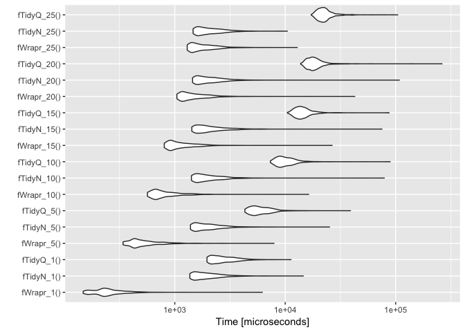
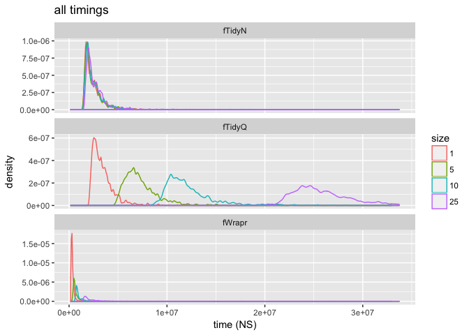
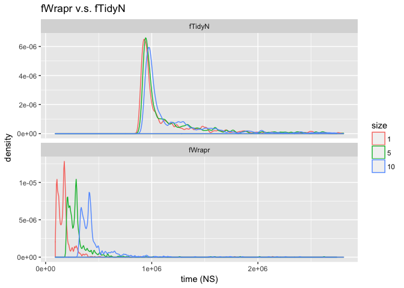
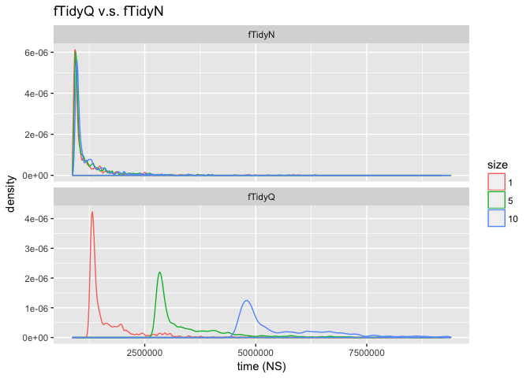

Some timings for [`wrapr::let()`](https://github.com/WinVector/wrapr).

Keep in mind for any *serious* application the calculation time on data will far dominate any expression re-write time from either `rlang`/`tidyeval` or `wrapr`. But it has been [asked what the timings are](http://www.win-vector.com/blog/2017/06/please-consider-using-wraprlet-for-replacement-tasks/#comment-66574), and it is fun to look.

So we will compare:

-   `fWrapr*` `wrapr::let()` substitution (`"langsubs"` mode).
-   `fTidyN*` `rlang::eval_tidy()` substitution to quoted names (the closest I found to `wrapr::let()`).
-   `fTidyQ*` `rlang::eval_tidy()` substitution to `quo()` free names (what seems to be the preferred case/notation by `rlang`/`tidyeval` developers as it moves from NSE (non-standard evaluation interface) to NSE).

``` r
library("microbenchmark")
library("wrapr")
library("rlang")
suppressPackageStartupMessages(library("ggplot2"))
suppressPackageStartupMessages(library("dplyr"))

# load generated examples
source("genFns.R")

# load up vars
nvars <- 200
for(i in seq(0, nvars-1)) {
  assign(paste('var', i, sep='_'), i)
}

fWrapr_1 <- function() {
  let(
   c( NM_0 = 'var_0' ),
   NM_0
 )}
 
fTidyN_1 <- function() {
   NM_0 = as.name('var_0')
   eval_tidy(quo( (!!NM_0) ))
}
 
fTidyQ_1 <- function() {
   NM_0 = quo(var_0)
   eval_tidy(quo( (!!NM_0) ))
}

fWrapr_1()
```

    ## [1] 0

``` r
fTidyN_1()
```

    ## [1] 0

``` r
fTidyQ_1()
```

    ## [1] 0

``` r
fWrapr_5 <- function() {
  let(
   c( NM_0 = 'var_0', NM_1 = 'var_1', NM_2 = 'var_2', NM_3 = 'var_3', NM_4 = 'var_4' ),
   NM_0 + NM_1 + NM_2 + NM_3 + NM_4
 )}
 
fTidyN_5 <- function() {
   NM_0 = as.name('var_0')
   NM_1 = as.name('var_1')
   NM_2 = as.name('var_2')
   NM_3 = as.name('var_3')
   NM_4 = as.name('var_4')
   eval_tidy(quo( (!!NM_0) + (!!NM_1) + (!!NM_2) + (!!NM_3) + (!!NM_4) ))
}
 
fTidyQ_5 <- function() {
   NM_0 = quo(var_0)
   NM_1 = quo(var_1)
   NM_2 = quo(var_2)
   NM_3 = quo(var_3)
   NM_4 = quo(var_4)
   eval_tidy(quo( (!!NM_0) + (!!NM_1) + (!!NM_2) + (!!NM_3) + (!!NM_4) ))
}


fWrapr_5()
```

    ## [1] 10

``` r
fTidyN_5()
```

    ## [1] 10

``` r
fTidyQ_5()
```

    ## [1] 10

``` r
fWrapr_25()
```

    ## [1] 300

``` r
fTidyN_25()
```

    ## [1] 300

``` r
fTidyQ_25()
```

    ## [1] 300

``` r
bm <- microbenchmark(
  fWrapr_1(),
  fTidyN_1(),
  fTidyQ_1(),
  fWrapr_5(),
  fTidyN_5(),
  fTidyQ_5(),
  fWrapr_10(),
  fTidyN_10(),
  fTidyQ_10(),
  fWrapr_15(),
  fTidyN_15(),
  fTidyQ_15(),
  fWrapr_20(),
  fTidyN_20(),
  fTidyQ_20(),
  fWrapr_25(),
  fTidyN_25(),
  fTidyQ_25(), 
  times=1000L
)
print(bm)
```

    ## Unit: microseconds
    ##         expr       min         lq       mean     median         uq
    ##   fWrapr_1()    81.166    97.0785   131.3688   131.5470   152.4405
    ##   fTidyN_1()   868.700   921.0035  1025.4439   946.4280   993.4945
    ##   fTidyQ_1()  1256.923  1336.5920  1450.9863  1372.3695  1438.4810
    ##   fWrapr_5()   173.873   196.4895   234.4595   231.5865   254.9050
    ##   fTidyN_5()   882.654   934.0505  1022.9872   961.1020  1003.5345
    ##   fTidyQ_5()  2807.695  2971.2335  3261.4569  3048.5575  3193.3340
    ##  fWrapr_10()   278.172   305.5015   355.9920   347.7075   368.5540
    ##  fTidyN_10()   896.417   951.8255  1064.2228   978.0515  1028.4360
    ##  fTidyQ_10()  4728.025  5039.9965  5412.5014  5172.3060  5411.2375
    ##  fWrapr_15()   386.372   420.1360   492.9664   461.1000   484.8230
    ##  fTidyN_15()   907.907   965.5870  1092.4973   993.4760  1039.8020
    ##  fTidyQ_15()  6681.984  7119.9040  7735.3392  7289.8135  7601.3360
    ##  fWrapr_20()   497.820   541.1490   614.5504   582.5750   605.4730
    ##  fTidyN_20()   924.507   984.2825  1142.5485  1014.7785  1060.4025
    ##  fTidyQ_20()  8576.194  9133.5940  9803.4344  9365.4490  9774.6895
    ##  fWrapr_25()   610.156   658.5005   716.6674   698.6040   727.4150
    ##  fTidyN_25()   943.537  1004.2730  1087.4585  1032.8770  1073.3885
    ##  fTidyQ_25() 10499.049 11201.7910 11896.5791 11469.3995 12368.2055
    ##        max neval
    ##   1620.776  1000
    ##   5947.417  1000
    ##   3891.465  1000
    ##   3275.271  1000
    ##  11282.839  1000
    ##  52535.842  1000
    ##   6891.998  1000
    ##  23621.423  1000
    ##  24138.244  1000
    ##  12149.502  1000
    ##  34545.549  1000
    ##  92523.161  1000
    ##  19079.721  1000
    ##  53876.804  1000
    ##  60252.314  1000
    ##   2519.169  1000
    ##   3040.419  1000
    ##  61312.311  1000

``` r
autoplot(bm)
```



``` r
d <- as.data.frame(bm)
d$size <- as.numeric(gsub("[^0-9]+", "", d$expr))
d$fn <- gsub("[_0-9].*$", "", d$expr)

mkPlot <- function(d, title) {
  d$size <- as.factor(d$size)
  highCut <- as.numeric(quantile(d$time, probs = 0.99))
  dcut <- d[d$time<=highCut, , drop=FALSE]
  
  ggplot(data=dcut, aes(x=time, group=expr, color=size)) +
    geom_density(adjust=0.3) +
    facet_wrap(~fn, ncol=1, scales = 'free_y') +
    xlab('time (NS)') + ggtitle(title)
}

mkPlot(d, 'all timings')
```



``` r
mkPlot(d[d$fn %in% c('fWrapr', 'fTidyN'), , drop=FALSE], 
       'fWrapr v.s. fTidyN')
```



``` r
mkPlot(d[d$fn %in% c('fTidyQ', 'fTidyN'), , drop=FALSE], 
       'fTidyQ v.s. fTidyN')
```



``` r
# fit a linear function for runtime as a function of size
# per group.
fits <- d %>%
  split(., .$fn) %>%
  lapply(., 
         function(di) { 
           lm(time ~ size, data=di) 
         }) %>%
  lapply(., coefficients) %>%
  lapply(., 
         function(ri) {
           data.frame(Intercept= ri[["(Intercept)"]],
                      size= ri[['size']])
         }) 
dfits <- bind_rows(fits)
dfits$fn <- names(fits)

# "Intercept" is roughly start-up cost 
# "size" is slope or growth rate
print(dfits)
```

    ##   Intercept       size     fn
    ## 1 1020567.6   4102.007 fTidyN
    ## 2 1068077.5 436208.320 fTidyQ
    ## 3  111251.3  24717.061 fWrapr

``` r
# solve for size where two lines interesect.
# Note: this is a naive estimate, and not stable
# in the face of estimated slopes and intercepts.
solve <- function(dfits, f1, f2) {
  idx1 <- which(dfits$fn==f1)
  idx2 <- which(dfits$fn==f2)
  size <- (dfits$Intercept[[idx1]] - dfits$Intercept[[idx2]]) /
    (dfits$size[[idx2]] - dfits$size[[idx1]])
  size
}

crossingPoint <- solve(dfits, 'fTidyN', 'fWrapr')
print(crossingPoint)
```

    ## [1] 44.10933

Overall:

-   Remember: these timings are *not* important, for any interesting calculation data manipulation time will quickly dominate expression manipulation time (meaning [tuning here is not important](https://en.wikipedia.org/wiki/Amdahl%27s_law)).
-   `fWrapr*` is fastest, but seems to have worse size dependent growth rate (or slope) than `fTidyN*`. This means that we would expect at some large substitution size `fTidyN*` could become quicker (about 44 or more variables). Likely `wrapr::let()` is paying too much for a map-lookup somewhere and this could be fixed at some point.
-   `fTidyQ*` is very much slower with a much worse slope. Likely the slope is also some expensive mapping that can also be fixed.
